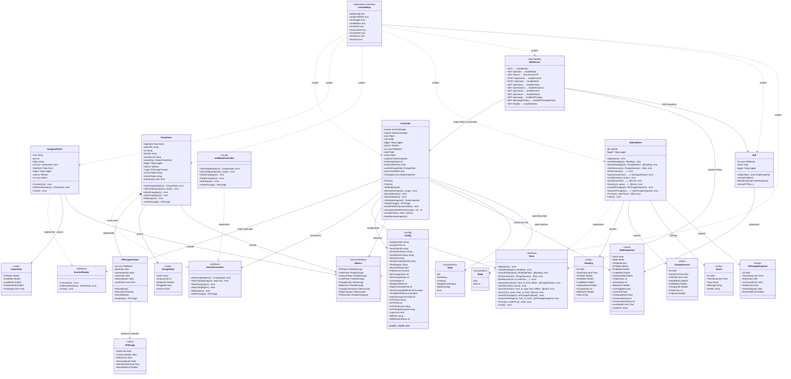

# Solar EV Charger Controller — Architecture

```mermaid
classDiagram
    direction TB

    %% ─── Interfaces ───
    class InverterReader {
        <<interface>>
        +Connect(ctx) error
        +GetPowerData(ctx) PowerData, error
        +Close() error
    }

    class VehicleController {
        <<interface>>
        +GetChargeState(ctx) ChargeState, error
        +SetChargingAmps(ctx, amps int) error
        +StartCharging(ctx) error
        +StopCharging(ctx) error
        +WakeUp(ctx) error
        +GetAPIUsage() APIUsage
    }

    class Store {
        <<interface>>
        +Migrate(ctx) error
        +InsertReading(ctx, Reading) error
        +QueryReadings(ctx, ReadingFilter) []Reading, error
        +StartSession(ctx, ChargeSession) int64, error
        +EndSession(ctx, id, endTime, …) error
        +QuerySessions(ctx, from, to, limit, offset) []ChargeSession, error
        +InsertEvent(ctx, Event) error
        +QueryEvents(ctx, from, to, type, limit, offset) []Event, error
        +Search(ctx, query, from, to, limit) []Event, error
        +InsertAPIUsage(ctx, APIUsageSnapshot) error
        +QueryAPIUsage(ctx, from, to, limit) []APIUsageSnapshot, error
        +Prune(ctx, olderThan) int64, error
        +Close() error
    }

    %% ─── Config ───
    class Config {
        <<config>>
        +SungrowHost string
        +SungrowPort int
        +TeslaClientID string
        +TeslaClientSecret string
        +TeslaRefreshToken string
        +TeslaVIN string
        +TeslaPrivateKeyPath string
        +TeslaRegion string
        +TeslaTestMode bool
        +PollInterval Duration
        +MinChargeAmps int
        +MaxChargeAmps int
        +LineVoltage int
        +DeadbandPolls int
        +WakeThresholdPolls int
        +TeslaChargingPollInterval Duration
        +TeslaIdlePollInterval Duration
        +AmpsChangeThreshold int
        +HTTPHost string
        +HTTPPort int
        +HTTPAuthUser string
        +HTTPAuthPassword string
        +LogLevel Level
        +DBPath string
        +DBRetentionDays int
        +Load()$ Config, error
    }

    %% ─── Inverter ───
    class PowerData {
        <<value>>
        +PVWatts float64
        +GridWatts float64
        +LoadWatts float64
        +SurplusWatts float64
        +Timestamp time.Time
    }

    class SungrowClient {
        -host string
        -port int
        -token string
        -wsConn *websocket.Conn
        -httpClient *http.Client
        -logger *slog.Logger
        -metrics *Metrics
        -mu sync.Mutex
        +Connect(ctx) error
        +GetPowerData(ctx) PowerData, error
        +Close() error
    }

    %% ─── Tesla ───
    class ChargeState {
        <<value>>
        +State string
        +AmpsActual int
        +BatteryPct float64
        +PluggedIn bool
        +IsOnline bool
    }

    class APIUsage {
        <<value>>
        +DataCalls int64
        +CommandCalls int64
        +WakeCalls int64
        +StreamSignals int64
        +MonthStarted time.Time
        +EstimatedCost float64
    }

    class APIUsageTracker {
        -mu sync.RWMutex
        -dataCalls int64
        -commandCalls int64
        -wakeCalls int64
        -streamSignals int64
        -monthStart time.Time
        +RecordData()
        +RecordCommand()
        +RecordWake()
        +Snapshot() APIUsage
    }

    class TeslaClient {
        -httpClient *http.Client
        -baseURL string
        -vin string
        -clientID string
        -clientSecret string
        -privateKey *ecdsa.PrivateKey
        -logger *slog.Logger
        -metrics *Metrics
        -usage *APIUsageTracker
        -accessToken string
        -refreshToken string
        -tokenExpiry time.Time
        +GetChargeState(ctx) ChargeState, error
        +SetChargingAmps(ctx, amps) error
        +StartCharging(ctx) error
        +StopCharging(ctx) error
        +WakeUp(ctx) error
        +GetAPIUsage() APIUsage
    }

    class testModeController {
        <<no-op>>
        +GetChargeState(ctx) ChargeState, error
        +SetChargingAmps(ctx, amps) error
        +StartCharging(ctx) error
        +StopCharging(ctx) error
        +WakeUp(ctx) error
        +GetAPIUsage() APIUsage
    }

    %% ─── Storage ───
    class Reading {
        <<entity>>
        +ID int64
        +Timestamp time.Time
        +PVWatts float64
        +GridWatts float64
        +LoadWatts float64
        +SurplusWatts float64
        +ChargeAmps int
        +BatteryPct float64
        +State string
    }

    class ChargeSession {
        <<entity>>
        +ID int64
        +StartTime time.Time
        +EndTime time.Time
        +StartBattery float64
        +EndBattery float64
        +EnergyKWh float64
        +PeakAmps int
        +AvgAmps float64
    }

    class Event {
        <<entity>>
        +ID int64
        +Timestamp time.Time
        +Type string
        +Message string
        +Details string
    }

    class APIUsageSnapshot {
        <<entity>>
        +ID int64
        +Timestamp time.Time
        +DataCalls int64
        +CommandCalls int64
        +WakeCalls int64
        +StreamSignals int64
        +EstimatedCost float64
    }

    class SQLiteStore {
        -db *sql.DB
        -logger *slog.Logger
        +Migrate(ctx) error
        +InsertReading(ctx, Reading) error
        +QueryReadings(ctx, ReadingFilter) []Reading, error
        +StartSession(ctx, ChargeSession) int64, error
        +EndSession(ctx, …) error
        +QuerySessions(ctx, …) []ChargeSession, error
        +InsertEvent(ctx, Event) error
        +QueryEvents(ctx, …) []Event, error
        +Search(ctx, query, …) []Event, error
        +InsertAPIUsage(ctx, APIUsageSnapshot) error
        +QueryAPIUsage(ctx, …) []APIUsageSnapshot, error
        +Prune(ctx, olderThan) int64, error
        +Close() error
    }

    %% ─── Controller ───
    class State {
        <<enumeration>>
        Idle
        Monitoring
        Charging
        StoppedLowSurplus
        WakePending
        Error
    }

    class Mode {
        <<enumeration>>
        Auto
        Manual
    }

    class StateSnapshot {
        <<value>>
        +State State
        +Mode Mode
        +TestMode bool
        +PVWatts float64
        +GridWatts float64
        +LoadWatts float64
        +SurplusWatts float64
        +TargetAmps int
        +ActualAmps int
        +BatteryPct float64
        +CarPluggedIn bool
        +CarOnline bool
        +ChargingState string
        +ConsecutiveLow int
        +ConsecutiveSurplus int
        +LastUpdate time.Time
        +LastError string
    }

    class Controller {
        -inverter InverterReader
        -vehicle VehicleController
        -store Store
        -cfg Config
        -logger *slog.Logger
        -metrics *Metrics
        -mu sync.RWMutex
        -state State
        -mode Mode
        -snapshot StateSnapshot
        -lastChargeAmps int
        -lastTeslaPoll time.Time
        -cachedChargeState ChargeState
        -hasCachedState bool
        +OnUpdate func~StateSnapshot~
        +Run(ctx)
        +Tick(ctx)
        +SetMode(mode)
        +ManualSetAmps(ctx, amps) error
        +ManualStart(ctx) error
        +ManualStop(ctx) error
        +GetStateSnapshot() StateSnapshot
        +GetAPIUsage() APIUsage
        -shouldPollTesla(surplusWatts) bool
        -calculateAvailableAmps(surplus, cs) int
        -transitionTo(ctx, state, reason)
        -flushMinuteAverage(ctx)
    }

    %% ─── Observability ───
    class Metrics {
        <<instrumentation>>
        +PVPower Float64Gauge
        +GridPower Float64Gauge
        +SurplusPower Float64Gauge
        +LoadPower Float64Gauge
        +ChargeAmps Int64Gauge
        +BatteryPct Float64Gauge
        +ChargeCommands Int64Counter
        +StateChanges Int64Counter
        +PollDuration Float64Histogram
    }

    %% ─── Web ───
    class Hub {
        -mu sync.RWMutex
        -clients map
        -logger *slog.Logger
        +Subscribe() chan StateSnapshot
        +Unsubscribe(ch)
        +Broadcast(snap StateSnapshot)
        +ServeHTTP(w, r)
    }

    class WebServer {
        <<http.Handler>>
        +GET / → handleIndex
        +GET /api/state → handleState
        +GET /events → Hub.ServeHTTP
        +POST /api/control → handleControl
        +POST /api/mode → handleMode
        +GET /api/history → handleHistory
        +GET /api/sessions → handleSessions
        +GET /api/events → handleEvents
        +GET /api/search → handleSearch
        +GET /api/usage → handleAPIUsage
        +GET /api/usage/history → handleAPIUsageHistory
        +GET /healthz → handleHealthz
    }

    %% ─── cmd/server ───
    class runtimeDeps {
        <<dependency injection>>
        +loadConfig func
        +setupOTelSDK func
        +newLogger func
        +newMetrics func
        +newStore func
        +newInverter func
        +newVehicle func
        +newServer func
        +newHub func
    }

    %% ════════════ Relationships ════════════

    %% Interface implementations
    SungrowClient ..|> InverterReader : implements
    TeslaClient ..|> VehicleController : implements
    testModeController ..|> VehicleController : implements
    SQLiteStore ..|> Store : implements

    %% Controller dependencies (uses interfaces)
    Controller --> InverterReader : reads solar data
    Controller --> VehicleController : controls EV
    Controller --> Store : persists data
    Controller --> Config : configuration
    Controller --> Metrics : telemetry

    %% Controller produces
    Controller --> StateSnapshot : creates per tick
    Controller --> State : state machine
    Controller --> Mode : operating mode

    %% TeslaClient internal composition
    TeslaClient *-- APIUsageTracker : tracks costs
    APIUsageTracker --> APIUsage : produces snapshot

    %% SungrowClient returns
    SungrowClient --> PowerData : returns

    %% TeslaClient returns
    TeslaClient --> ChargeState : returns

    %% Storage entities
    SQLiteStore --> Reading : persists
    SQLiteStore --> ChargeSession : persists
    SQLiteStore --> Event : persists
    SQLiteStore --> APIUsageSnapshot : persists

    %% Web layer
    WebServer --> Controller : reads state & commands
    WebServer --> Store : queries history
    WebServer --> Hub : SSE broadcast
    Hub --> StateSnapshot : broadcasts

    %% Entry point wiring
    runtimeDeps ..> Controller : creates
    runtimeDeps ..> SungrowClient : creates
    runtimeDeps ..> TeslaClient : creates
    runtimeDeps ..> SQLiteStore : creates
    runtimeDeps ..> WebServer : creates
    runtimeDeps ..> Hub : creates
    runtimeDeps ..> Metrics : creates

    %% Observability
    SungrowClient --> Metrics : records
    TeslaClient --> Metrics : records
```
